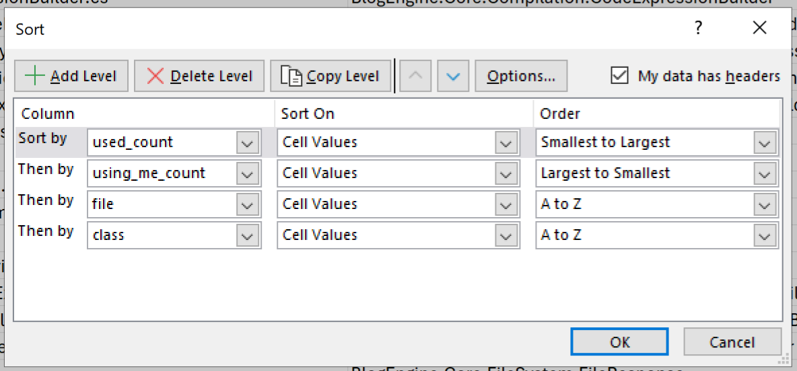

# .NET Framework Code Conversion

This is an experiment on the practical use and workflow of converting a .NET Framework application to a DotNet Core Web API and React application.  The objective is:

- Use and improve Aici for code generation and conversion
- Convert code from one framework to another like for like
- For this purpose, we will also attempt to convert languages
- Prove the ability to convert .NET Framework Web Forms to DotNet Core API with a React front end.

The process is as follows:

1. **Discovery**
   1. **Build & Run Unmodified** - Start by building and running the unmodified code.
   2. **Code Analysis** - We need to determine the files with the least depenendcies.
   2. **Conversion Tracking** - We will want to track the files that were converted - from and to.

## 1. Discovery

The application selected for this project was BlogEngine due to it's use of Web Forms and .NET Framework.

- <https://github.com/BlogEngine/BlogEngine.NET>

### 1.1 Build and Run Unmodified

My primary environment is a Mac - and we want the new BlogEngine to be platform independent.  But when converting the application, we need to ensure that the code we have is functional, and we will need a functioning system to reference and debug as we convert it.

#### 1.1.1 Development Environment

We'll start by setting up the following development environment:

- Windows 2022 VM in AWS
- Visual Studio 2022 - Current state
- Visual Studio Code - Target State
- GIT
- Tortious GIT
- NotePad++
- PodMan

#### 1.1.2 Building Current State

When we open the project in Visual Sudio 2022, .NET Framework 4.5 is not avaiable.  We'll want to upgrade the projects to .NET Framework 4.8.

Review the application's documentation:

- BlogEngine.NET\README.md

First sanity check is to right click the solution in Visual Studio and build the solution.  Make sure that no errors were encountered.  Secondly, run the application.

Once we are able to build and run the application, we have confirmed that we have everything needed.  Next step is to do some analisys to determine where to start from.

### 1.4 File Dependencies

For this process, we'll use NDepend:

- <https://www.ndepend.com/download>

For the file dependencies, you'll want to use the project we provided: `NDepend.PowerTools.SourceCode`.  When ran, you'll choose "Dependency Report".  This will write the output file to `c:\code\dependencies.csv`.  This is a modified NDepends Power Tools application.  It expects that `NDepends` is installed into `c:\code\NDepends`.

Sort the data in the CSV by "used_count" small to large, and "uses_me_count" large to small.  This will prioritize the files that done have dependencies while sufficing the dependencies needed by many.

When looking over the file that are multiple times on the list, if the pattern you find is multiple 'types' per file, we'll want to refactor this to a single type per file.

If we see the following pattern:

- **Full.Name.Space.Type+Type** - this indicates the nesting of declarations - enum in a class, class in a class
- **Full.Name.Space.Type** - could be multiple classes, enums, or a mix

Generally, we'll want to refactor this to use distinct file per declaration.

### 1.5 Units of Work

For the purpose of project tracking and estimation, we can consider each FullName as the unit or work, and the line count to be the size.  From this you can calculate a velocity if we track when each file is completed.

This covers the completion as the project progresses.  To get a full picture of the project, we'll need to track the time as we progress.  This data will be critical in estimating projects.

As the conversion occurs, we can track the following:

- Initial Conversion
  - Put a completed date in the file.  Using this, you could import the table into SQL to calculate velocities and completion dates.
- Bootstrapping
  - We will need to assemble all the converted files, and the non-code artifacts into a working system.
  - This should be a multiple of the 'Initial Conversion' time.
- Debugging
  - This should be conducted in such a way that all critical functionality is tested.
  - Again, this should be a multiple of 'Initial Conversion' and 'Bootstrapping' time.

### 1.6 Order of Work

We'll want to work the classes with the lowest number of types used (use) and the highest number of type using it (NbTypesUsingMe).

### 1.7 Code Review

Look at each project type.

Peruse each file in each folder and get a feel for the applications architecture.  You could use the DOS "tree" command to print out the tree structure.  Make note of the file types/content/purpose in the each folder: for example - data access objects, user interface, controls, business logic, web APIs, etc.

Look for anti-patterns.

Look at files that have no references.  This could be an indication that the file in not needed.  In that case, do not convert the file.

## 2 Conversion

### 2.1 Approach

As we work through each file in the original system we'll want to create the same directory structure and try to keep things as "one to one" as possible.  If the original file was "workspace/original_code/project_a/folder/type_file.cs" then the target state should be "workspace/target_code/project_a/folder/type_file.ts".

Secondly, as we work through the original code, we'll be using Aici to generate the target code.  We'll use prompts functionality.  This can be used to generalize prompts for common patterns.

Third, is Aici provides a less than sufficient answer, or the final code differs from the original answer, make to either update the prompt to be more specific, or save the response to datasets and correct the response.

When folders are completed, upload the code to Aici and run Finetunning.  This will assist the system to understand the application, and also in generating responses for the target state better.

By doing this you'll be constantly improving the system as you use it.  This data could be moved from project to project for accumulating effects.

#### 2.1.1 Anti-Pattern Documentation

Document anti-patterns as you run into them.  These would include items the system is not capable of converting with a high percentage of completion and accuracy.

These contradictions will be used to eliminate candidate applications that don't convert nicely.  It could also be used to determine where to invest time to improve tooling, template prompts, and or additional dataset training.

#### 2.1.2 Status Tracker

We've taken out `dependencies.csv` file and sorted by:

I've added the following columns to track status and information about status, improvements, and patterns:

- Completed - date
- Notes - approach reasoning and authoritative references
- Pattern / Prompt - Aici prompt title
- Correction / Dataset - Aici dataset title
- Anti-Pattern / Contradictions - explanation or blocker and impact

## 2.2 Conversion

Make sure you have a running copy of Aici:

- <https://github.com/shawnzernik/ts-react-express>

You'll want to configure the API Key using you OpenAI API Key.  Upload a zip of the latest Aici and finetune Aici.  You should have a base configured system from training during development.  This can be used to enhance Aici as well.

### 2.2.1 First File

We'll be targeting a specific type within a file.  If their is a nested type associated (Type+Type), do the nested type first.

We'll create a prompt:

- Title: BlogEngine - No React - Type in File - 0 Dependencies
- Input: leave blank for now

#### User

<!! project ORIGINAL_FILE ~/BlogEngineDotNet/BlogEngine.NET/BlogEngine/BlogEngine.Core/Data/Contracts/IDashboardRepository.cs !!/>

Convert the TYPE_NAME in %ORIGINAL_FILE% to TypeScript and use React where nessisary.

%SAVE_PROMPT%

#### Assistant

Save: TARGET_FILE